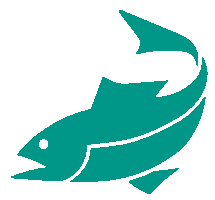
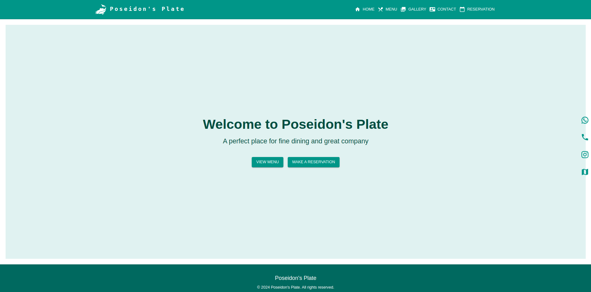
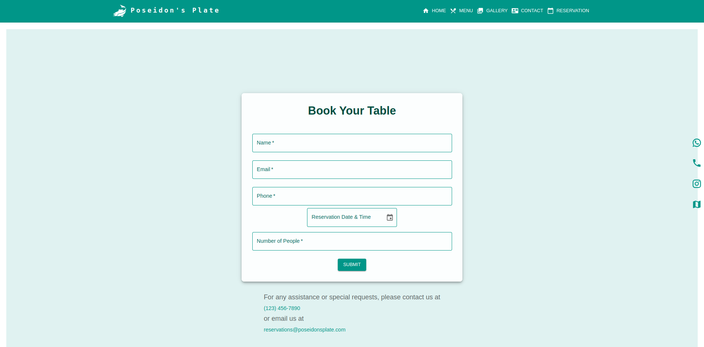
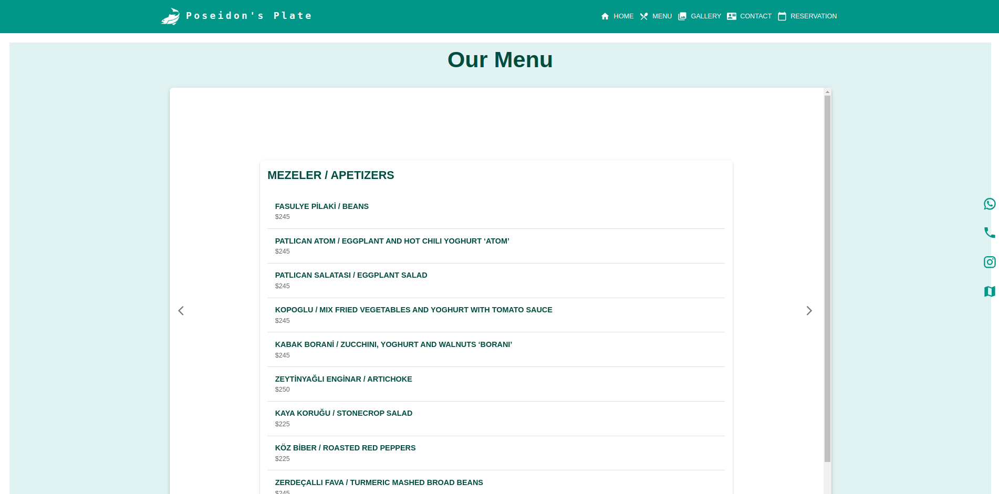
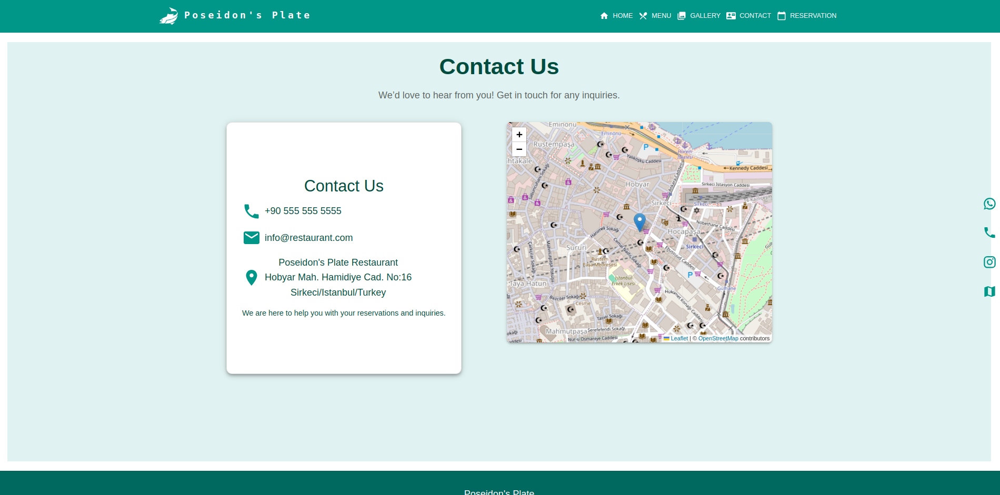
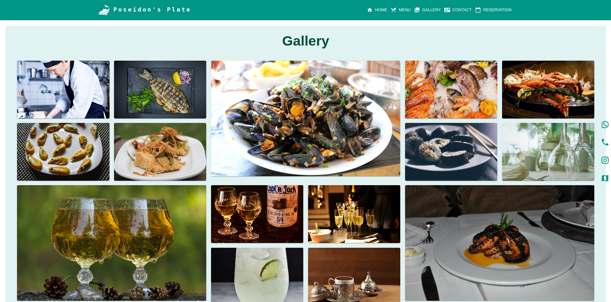

# Poseidon's Plate - Restaurant Website & Reservation System

 <!-- Assuming fish.png is in frontend/public -->

Welcome to Poseidon's Plate, a full-stack web application for a fictional fine-dining seafood restaurant. This project provides users with an elegant interface to explore the restaurant's menu, view a gallery, find contact information and location, and make table reservations online.

### Screenshots

|                                   |                                   |
| :-------------------------------: | :-------------------------------: |
|  |  |
|  |  |
|    |                                   |

---

## Features

- **Responsive Design:** Adapts to various screen sizes (desktop, tablet, mobile) using Material-UI.
- **Interactive Menu:** Browse the restaurant's menu with categories and prices, presented in an engaging page-flip interface (`react-pageflip`).
- **Image Gallery:** View high-quality images of the restaurant and dishes in a structured grid layout.
- **Contact Information:** Easy access to phone number, email, and address.
- **Interactive Map:** Embedded Leaflet map showing the restaurant's location (`react-leaflet`).
- **Online Reservations:**
  - Users can book a table using a simple form with date and time selection (`@mui/x-date-pickers`).
  - Backend validation checks for time slot availability (limits reservations within a +/- 30-minute window).
  - Real-time feedback on reservation success or failure (e.g., slot full).
- **Persistent Data:** Reservations are stored in a MongoDB database.
- **Quick Contact Buttons:** Fixed side buttons for easy access to WhatsApp, Phone, Instagram, and Map directions.
- **Themed Interface:** Consistent and appealing theme using Material-UI (`@mui/material`).

---

## Technology Stack

- **Frontend:**
  - React (`react`)
  - React Router (`react-router-dom`) for navigation
  - Material-UI (`@mui/material`, `@mui/icons-material`, `@mui/x-date-pickers`) for UI components and styling
  - Axios (`axios`) for API communication
  - React Leaflet (`react-leaflet`) for interactive maps
  - React PageFlip (`react-pageflip`) for the menu interface
  - Date-Fns (`date-fns`, `@date-io/date-fns`) for date/time handling with MUI pickers
- **Backend:**
  - Node.js (`node`)
  - Express (`express`) for the REST API framework
  - Mongoose (`mongoose`) for MongoDB object data modeling
  - dotenv (`dotenv`) for environment variable management
  - CORS (`cors`) for enabling cross-origin requests
- **Database:**
  - MongoDB (Cloud or Local)

## Installation and Setup

1.  **Clone the Repository:**

    ```bash
    git clone https://github.com/Mordris/poseidons-plate
    cd poseidons-plate
    ```

2.  **Setup Backend:**

    - Navigate to the backend directory (e.g., `cd backend` or stay in root if backend files are there).
    - Install dependencies:
      ```bash
      npm install
      # or
      yarn install
      ```
    - Create a `.env` file in the backend directory (`backend/.env`) with the following content:
      ```env
      MONGODB_URI=your_mongodb_connection_string
      PORT=5000
      ```
      Replace `your_mongodb_connection_string` with your actual MongoDB connection string (e.g., from MongoDB Atlas). `PORT` is the port the backend server will run on (default is 5000 if not specified).

3.  **Setup Frontend:**

    - Navigate to the frontend directory:
      ```bash
      cd ../frontend
      # or from root: cd frontend
      ```
    - Install dependencies:
      ```bash
      npm install
      # or
      yarn install
      ```
    - **Important:** Ensure the `baseURL` in `frontend/src/api/api.js` matches the backend server address (it's currently set to `http://localhost:5000`). Adjust if your backend runs on a different port or domain.

4.  **MongoDB:**
    - Make sure you have a MongoDB database running and accessible using the connection string provided in the `.env` file. You can use a local instance or a cloud service like MongoDB Atlas.

---

## Running the Application

1.  **Start the Backend Server:**

    - Navigate to the backend directory (`cd backend` or stay in root).
    - Run the start script (assuming one is defined in `backend/package.json`, e.g., `"start": "node server.js"`, `"dev": "nodemon server.js"`):
      ```bash
      npm start
      # or for development with nodemon
      npm run dev
      ```
    - The backend server should start, typically on port 5000 (or the port specified in `.env`). You should see a "MongoDB connected successfully" message followed by "Server is running on port XXXX".

2.  **Start the Frontend Development Server:**
    - Navigate to the frontend directory (`cd ../frontend` or `cd frontend`).
    - Run the start script:
      ```bash
      npm start
      # or
      yarn start
      ```
    - This will usually open the application automatically in your default web browser at `http://localhost:3000`.

Now you can interact with the Poseidon's Plate application locally!

---

## API Endpoints

The backend provides the following API endpoints (base path `/api/reservations`):

- **`POST /`**: Creates a new reservation.
  - **Body (JSON):** `{ name, phone, email, dateTime, numberOfPeople }`
  - **Response (Success):** `201 Created` with `{ message: "Reservation created successfully" }`
  - **Response (Failure - Slot Full):** `400 Bad Request` with `{ message: "We're so busy at that time. Please select another time." }`
  - **Response (Failure - Server Error):** `500 Internal Server Error` with `{ message: "An error occurred", error: error.message }`
- **`GET /`**: Retrieves all existing reservations.
  - **Response (Success):** `200 OK` with an array of reservation objects.
  - **Response (Failure):** `500 Internal Server Error` with `{ message: "An error occurred", error: error.message }`

---

## Contributing

Contributions are welcome! If you'd like to contribute, please follow these steps:

1.  Fork the repository.
2.  Create a new branch (`git checkout -b feature/your-feature-name`).
3.  Make your changes.
4.  Commit your changes (`git commit -m 'Add some feature'`).
5.  Push to the branch (`git push origin feature/your-feature-name`).
6.  Open a Pull Request.

---
